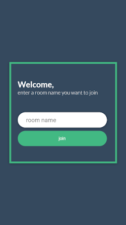
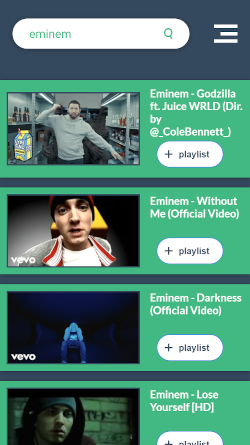
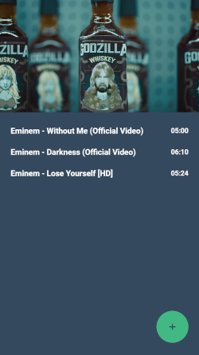

# Local Song Request

If you ever had a problem with queueing songs during for example a house party then this project could help you. Join/create rooms with shared Youtube playlist and state of a player and add your own songs using built in search page.

Project was built with Vue.js and a super simple Express server with socket.io.

## Preview






# Project setup

## Server

### Install dependencies

```bash
cd server
npm install
```

### Run server with hot reloads for development

```bash
npm run dev
```

## Client

## Install dependencies

```bash
cd client
npm install
```

### Compiles and hot-reloads for development

```
npm start
```

After all this steps the app should be up and running on http://localhost:8080/
